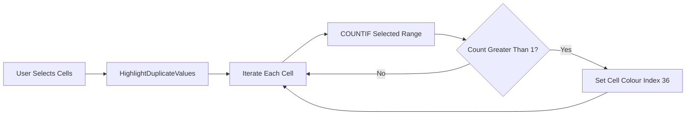
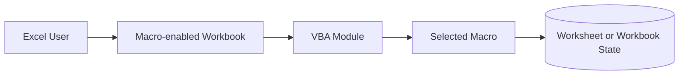

# Excel Macros

> **Document version:** R1.00  
> **Documentation status:** Reviewed from repository evidence  
> **Last code review:** 2026-07-14  
> **Repository:** https://github.com/Wattysaid/ExcelMacros  
> **Default branch:** `main`  
> **Commit reviewed:** `7ee8cb25c2ff8911c718ff8621db8ef8558983eb`  
> **Maintainer:** Wattysaid

Excel Macros is a personal collection of VBA utilities created to automate repetitive Microsoft Excel tasks. The repository contains small, independently executed macros for worksheet navigation, content transformation, formatting and duplicate-value identification. These scripts were created for personal productivity and have not been validated as production-grade business controls.

## Documentation Scope and Verification

| Item | Value |
|---|---|
| Repository reviewed | `https://github.com/Wattysaid/ExcelMacros` |
| Branch | `main` |
| Commit | `7ee8cb25c2ff8911c718ff8621db8ef8558983eb` |
| Review date | `2026-07-14` |
| Reviewer | `GPT-5.6 Thinking` |
| Review method | Static inspection of README, documented macro catalogue and selected macro source |
| Commands executed | None; macros were not executed in Excel |
| Excluded areas | Workbook-specific behaviour, macro security settings and complete file-by-file runtime validation |
| Confidence | Medium; macro purposes are documented, but execution was not verified |

### Documentation Status Legend

| Status | Meaning |
|---|---|
| **Verified** | Confirmed through source inspection and successful validation or tests |
| **Implemented, not executed** | Code exists and was inspected, but execution was not performed |
| **Partial** | Some expected handling or documentation is incomplete |
| **Unknown** | Evidence is insufficient or contradictory |

## Contents

- [Repository Purpose](#repository-purpose)
- [Macro Catalogue](#macro-catalogue)
- [Architecture and Execution Model](#architecture-and-execution-model)
- [Getting Started](#getting-started)
- [Inputs, Outputs and Side Effects](#inputs-outputs-and-side-effects)
- [Security and Operational Risks](#security-and-operational-risks)
- [Testing and Quality Assurance](#testing-and-quality-assurance)
- [Safe Change Guidance](#safe-change-guidance)
- [Release and Versioning](#release-and-versioning)
- [Changelog](#changelog)
- [Licence](#licence)

## Repository Purpose

The repository is intended to:

- Reduce repetitive Excel work.
- Provide reusable VBA snippets for personal use.
- Support experimentation and learning.
- Retain utilities that have previously saved manual effort.

The macros are not presented as suitable for regulated, financial, safety-critical or enterprise-controlled processes without additional review, testing and governance.

## Macro Catalogue

| Macro or File | Purpose | Status | Primary Side Effect | Notes |
|---|---|---|---|---|
| `splitCellContent` | Split line-break-separated cell content across multiple rows | Implemented, not executed | Inserts or populates worksheet rows | Workbook and range assumptions require review |
| `new_row` | Replace configured strings with line breaks in a selected column | Implemented, not executed | Modifies selected cell content | Exact replacement rules should be documented in source |
| `fomatAllTabs` | Intended to format workbook worksheets | Partial documentation | Potentially modifies all worksheet formatting | File name appears misspelt and behaviour remains unverified |
| `contentSummary` | Create a `Summary` worksheet listing and linking workbook sheets | Implemented, not executed | Creates or replaces summary content | Existing `Summary` sheet handling must be verified |
| `HighlightDuplicateValues` | Highlight duplicate values within the selected range | Implemented, not executed | Changes matching cell fill colour to colour index 36 | Blank cells and error values may also be treated as duplicates |

### Highlight Duplicate Values

The inspected macro iterates through the current Excel selection, uses `WorksheetFunction.CountIf` against the entire selected range and applies `Interior.ColorIndex = 36` when a value occurs more than once.

## Architecture and Execution Model

Each file is an independent VBA procedure intended to be copied into an Excel macro-enabled workbook and run manually through the VBA editor or Macro dialog. There is no shared package manager, central runtime, database or deployment pipeline.

## Getting Started

### Prerequisites

- Microsoft Excel with VBA support.
- A trusted copy of the macro source.
- A backup of the workbook before running macros that modify data or formatting.

### Add a Macro

1. Save the workbook as an Excel Macro-Enabled Workbook, usually `.xlsm`.
2. Press `Alt + F11` to open the Visual Basic for Applications editor.
3. Select **Insert > Module**.
4. Copy the required macro into the module.
5. Review workbook, worksheet, column and range assumptions in the code.
6. Save the workbook.

### Run a Macro

1. Select the required worksheet or range.
2. Press `Alt + F8`.
3. Select the macro procedure.
4. Choose **Run**.
5. Inspect the result before saving over the original workbook.

## Inputs, Outputs and Side Effects

| Input | Source | Validation | Output or Side Effect | Risk |
|---|---|---|---|---|
| Active workbook | Excel application state | Not consistently verified | Workbook content or formatting changes | Medium to high |
| Active worksheet | Excel selection context | Not consistently verified | Worksheet-specific changes | Medium |
| Selected range | User selection | Macro-specific | Modified values, rows or formatting | Medium |
| Sheet names | Code constants or workbook state | Macro-specific | New summary links or target operations | Medium |
| Search or replacement strings | Source code or user configuration | Not fully documented | Cell text changes | Medium |

## Security and Operational Risks

| Risk | Impact | Existing Mitigation | Required Practice |
|---|---|---|---|
| Destructive workbook changes | Data or formatting loss | User manually initiates macros | Work on a copy and retain backups |
| Wrong active sheet or selection | Changes applied to unintended data | Some macros use explicit selection | Confirm active workbook, worksheet and range before execution |
| Unsigned macro code | Malware or tampering risk | None verified | Review source and use trusted locations or signed macros |
| Hidden workbook assumptions | Runtime errors or incorrect output | Existing descriptions | Document required columns, ranges and sheet names per macro |
| Duplicate highlighting of blanks | Misleading formatting | None verified | Exclude empty cells where appropriate |
| Re-running creation macros | Duplicate sheets or content | Unknown | Add idempotency or explicit overwrite prompts |

## Testing and Quality Assurance

No automated VBA test suite was found.

| Test Type | Scenario | Result at Reviewed Commit | Gap |
|---|---|---|---|
| Syntax | Compile each module in the VBA editor | Not run | Compile status unknown |
| Functional | Run each macro on a representative test workbook | Not run | Behaviour unverified |
| Boundary | Empty selection, blank cells and single-cell ranges | Not run | Error handling unknown |
| Repeatability | Run the same macro twice | Not run | Idempotency unknown |
| Recovery | Undo or restore original workbook | Not run | VBA actions may not be fully undoable |

## Safe Change Guidance

- Preserve each existing macro unless removal is explicitly authorised.
- Do not rename macro procedures without updating documentation and any workbook buttons or shortcuts.
- Add `Option Explicit` and explicit variable declarations where absent.
- Avoid relying on `ActiveSheet`, `Selection` or implicit workbook state where a safer explicit reference is possible.
- Add input validation and clear user-facing error messages.
- Test on a disposable workbook containing normal, empty, duplicate and malformed data.
- Document every new macro in the catalogue with inputs, outputs and destructive side effects.

## Release and Versioning

| Item | Approach | Source of Truth |
|---|---|---|
| Macro version | Commit-based unless recorded within an individual file | Git history |
| Workbook compatibility | Not formally versioned | Macro implementation and Microsoft Excel |
| Documentation version | `R1.00` | `README.md` |

## Changelog

| Documentation Version | Date | Commit Reviewed | Author | Summary |
|---|---|---|---|---|
| R1.00 | 2026-07-14 | `7ee8cb25c2ff8911c718ff8621db8ef8558983eb` | GPT-5.6 Thinking | Reorganised the macro collection documentation and added execution, risk and governance guidance while preserving existing usage instructions and descriptions |

## Licence

No licence file was verified. Unless a licence exists elsewhere in the repository, reuse rights are not granted by default.
